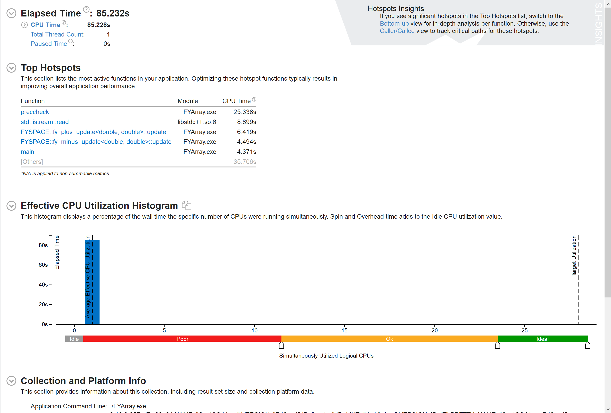

# Vtune



从Summary（图\ref{fig:summary}）中可以看出这是一个单线程程序，以及热点在于计算循环。

## Hotspots

实际计算在赋值时进行，evaluate函数中 (T_update实例化后为fy_plus_update/fy_minus_update/...)

~~~C++
// FYOps.hxx
template < typename T_numtype, int N_rank > template < typename T_expr, typename T_update >
FYArray <T_numtype, N_rank>&
FYArray<T_numtype, N_rank>::evaluateWithStackTraversalN(T_expr expr, T_update) {
    
    // ... 循环位置的处理
    
    // 计算循环
    for (int i = 0; i < ubound; ++i)
    {
    	T_update::update(*data++, expr.fastRead(i));
    }    
    //..
    
}

~~~

## 优化思路

### 计算语句级并行

~~~C++
worksx(I,J,K) = xfn(I,J,K,ns1) * area(I,J,K,ns1) + xfn(I-il1,J-jl1,K-kl1,ns1) * area(I-il1,J-jl1,K-kl1,ns1);
worksy(I,J,K) = yfn(I,J,K,ns1) * area(I,J,K,ns1) + yfn(I-il1,J-jl1,K-kl1,ns1) * area(I-il1,J-jl1,K-kl1,ns1);
worksz(I,J,K) = zfn(I,J,K,ns1) * area(I,J,K,ns1) + zfn(I-il1,J-jl1,K-kl1,ns1) * area(I-il1,J-jl1,K-kl1,ns1);

for ( int m = mst; m <= med; ++ m )
{
    dqdx_4d(I,J,K,m) = - worksx(I,J,K) * q_4d(I-il1,J-jl1,K-kl1,m);
    dqdy_4d(I,J,K,m) = - worksy(I,J,K) * q_4d(I-il1,J-jl1,K-kl1,m);
    dqdz_4d(I,J,K,m) = - worksz(I,J,K) * q_4d(I-il1,J-jl1,K-kl1,m);
}
~~~

赋值语句之间存在依赖，可以考虑使用计算图完成并行。(TBB Dependency Graph)


### 矩阵分块/分行并行

evaluateWithStackTraversalN函数中对矩阵进行拆解，最终得到内循环，使用for计算。

可以考虑在此处修改拆解方法，进行矩阵分块或分行并行。


### 优化Cache

~~~C++
dqdx_4d(I, J, K, m) -= worksx(I, J, K) * workqm(I, J, K);
dqdy_4d(I, J, K, m) -= worksy(I, J, K) * workqm(I, J, K);
dqdz_4d(I, J, K, m) -= worksz(I, J, K) * workqm(I, J, K);
~~~

由于矩阵非常大，不能完全装入缓存。例如此处`worksx(I, J, K)`，每个赋值语句需要从内存重新读取。

考虑每次读取一行，完成三个赋值语句后再进行下一行。


### 优化重复计算

```C++
dqdx_4d(I, J, K, m) -= worksx(I, J, K) * workqm(I, J, K);
dqdy_4d(I, J, K, m) -= worksy(I, J, K) * workqm(I, J, K);
dqdz_4d(I, J, K, m) -= worksz(I, J, K) * workqm(I, J, K);

dqdx_4d(I - il3, J - jl3, K - kl3, m) += worksx(I, J, K) * workqm(I, J, K);
dqdy_4d(I - il3, J - jl3, K - kl3, m) += worksy(I, J, K) * workqm(I, J, K);
dqdz_4d(I - il3, J - jl3, K - kl3, m) += worksz(I, J, K) * workqm(I, J, K);
```

`worksz(I, J, K) * workqm(I, J, K);` 进行了重复计算，考虑缓存这些中间结果。


### 算法优化


